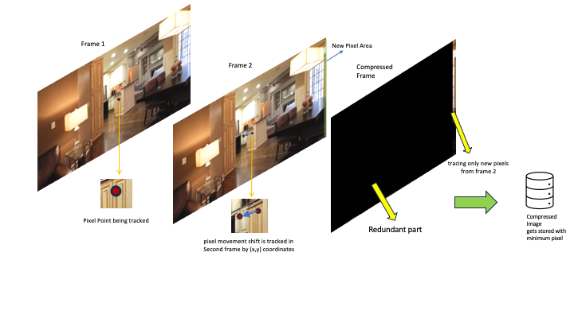

# Opti Pixel Video Encoder using $R^2S$ (Redundency Removal using Shift)

This is the official code release for our research paper 2024 "Optimal Video Compression using Pixel Shift Tracking" [[Paper]](https://arxiv.org/abs/2406.19630)

## Introduction
Optimizing video storage is an essential aspect of video processing, so we are proposing one of the possible approaches to achieve it is by avoiding redundant data at each frame. In this paper, we want to introduce the approach of redundancies removal in subsequent frames for a given video as a main approach for video compression. We call this method Redundancy Removal using Shift $R^2S$. This method can be utilized across various Machine Learning model algorithms, and make the compression more accessible and adaptable. In this study, we have utilized a computer vision-based pixel point tracking method to identify redundant pixels to encode video for optimal storage.




## Requirements

Follow the below steps to setup an environment to run the video compression,


```
conda create --name opti-vid-encode
source activate opt-vid-encode
pip install -r requirements.txt
```
To enable GPU run the below commands, and enable gpu from source code

```
conda create --name opti-vid-encode
source activate opt-vid-encode
conda install pytorch=1.12.0 torchvision=0.13.0 cudatoolkit=11.3 -c pytorch
pip install -r requirements.txt
```


## Demo
Download the weigths to run the pixel tracking from [Hugging Face](https://huggingface.co/aharley/pips) 
and put the model weights under ```reference_model/``` folder


Run, 

```
python src/video_compression.py
```

## Citation

If you use this code for your research, please cite:

Panneerselvam, Hitesh Saai Mananchery, and Smit Anand. "Optimal Video Compression using Pixel Shift Tracking." arXiv preprint arXiv:2406.19630 (2024).

Bibtex:

```
@article{panneerselvam2024optimal,
  title={Optimal Video Compression using Pixel Shift Tracking},
  author={Panneerselvam, Hitesh Saai Mananchery and Anand, Smit},
  journal={arXiv preprint arXiv:2406.19630},
  year={2024}
}
```